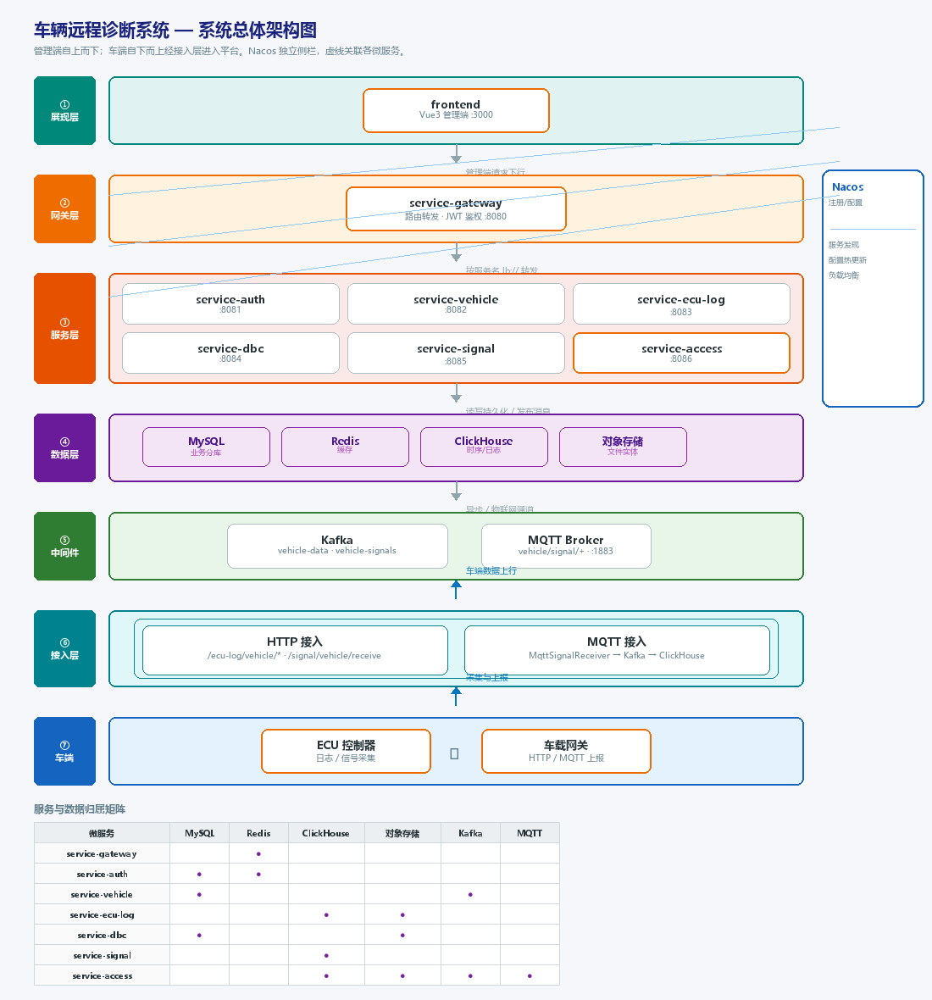
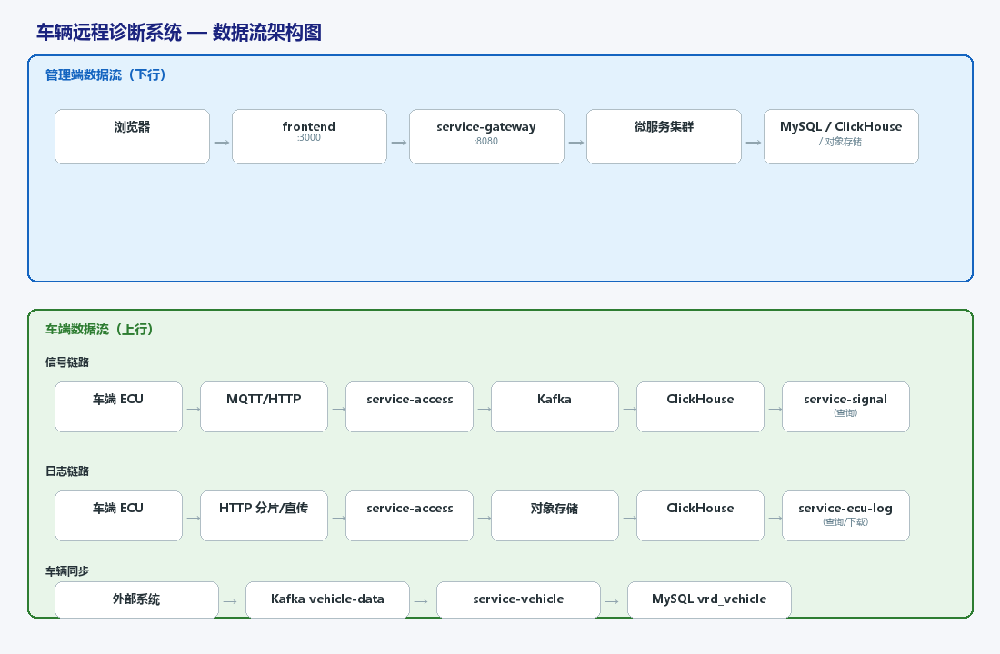
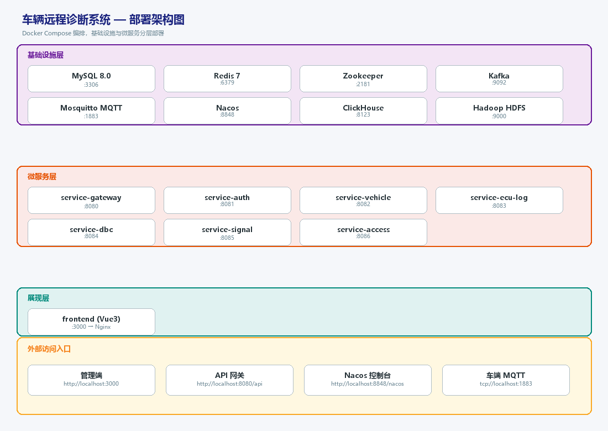

# 车辆远程诊断系统 — 系统概要设计说明

## 1. 文档信息

| 项目 | 内容 |
|------|------|
| 系统名称 | 车辆远程诊断系统（Vehicle Remote Diagnosis System，VRD） |
| 版本 | v1.0.0-SNAPSHOT |
| 架构模式 | Spring Cloud 微服务 + Vue3 前后端分离 |
| 编写依据 | 项目源码、`scripts/init.sql`、`docker-compose.yml` |

## 2. 建设目标

面向车企与售后运维场景，提供统一的车辆远程诊断平台，覆盖：

- **车辆主数据管理**：车型、车辆、ECU 零部件
- **远程数据接入**：MQTT/HTTP 信号上报、ECU 日志上传
- **诊断辅助**：DBC 配置管理、信号回放、故障/告警监控
- **系统管理**：用户认证、角色权限（RBAC 数据模型）

## 3. 总体架构

系统采用七层架构，自上而下为：展现层 → 网关层 → 服务层 → 数据层 → 中间件层 → 接入层 → 车端。Nacos 作为注册/配置中心独立侧挂，通过虚线关联网关与各微服务。

### 3.0 系统总体架构图

> **图 3-1 系统总体架构图**



架构分层说明：

| 序号 | 层次 | 核心组件 |
|------|------|----------|
| ① | 展现层 | frontend（Vue3 管理端 :3000） |
| ② | 网关层 | service-gateway（路由、JWT 鉴权 :8080） |
| ③ | 服务层 | auth / vehicle / ecu-log / dbc / signal / access |
| ④ | 数据层 | MySQL、Redis、ClickHouse、对象存储 |
| ⑤ | 中间件 | Kafka、MQTT Broker |
| ⑥ | 接入层 | HTTP 日志/信号上报、MQTT 信号订阅（service-access） |
| ⑦ | 车端 | ECU 控制器、车载网关 |

### 3.0.1 数据流架构图

> **图 3-2 数据流架构图**



### 3.1 微服务划分

| 服务 | 端口 | 职责 |
|------|------|------|
| service-gateway | 8080 | API 统一入口、路由转发、CORS、JWT 格式校验 |
| service-auth | 8081 | 登录注册、JWT 签发、用户/角色管理 |
| service-vehicle | 8082 | 车型/车辆/ECU、仪表盘统计、Kafka/API 同步 |
| service-ecu-log | 8083 | ECU 日志查询与下载（读 ClickHouse） |
| service-dbc | 8084 | DBC 文件上传解析、下发管理 |
| service-signal | 8085 | 车辆信号时序查询（读 ClickHouse） |
| service-access | 8086 | 车端统一接入：MQTT/HTTP 信号、日志上传 |

**公共模块**：`common`（统一响应、存储抽象、Nacos 配置）、`common-db`（MyBatis-Plus 分页）。

**遗留/未实现**：`service-register`（Eureka，未编入主 POM）、`service-bigdata`（代码不存在，ClickHouse 部分替代其 OLAP 职责）。

### 3.2 技术选型

| 层次 | 技术 |
|------|------|
| 后端框架 | Spring Boot 3.2.0、Spring Cloud 2023.0.0、Spring Cloud Alibaba 2022.0.0.0 |
| 服务发现/配置 | Nacos 2.2.3 |
| 网关 | Spring Cloud Gateway |
| ORM | MyBatis-Plus 3.5.9 |
| 认证 | JWT (jjwt 0.12.6) + BCrypt |
| 消息 | Kafka 3.6.0、MQTT (Mosquitto 2) |
| 关系库 | MySQL 8.0（按业务分库） |
| 分析库 | ClickHouse（时序信号、日志元数据） |
| 缓存 | Redis 7 |
| 前端 | Vue 3.4 + Vite 5 + Element Plus 2.4 + ECharts 5 |
| 部署 | Docker Compose |

## 4. 核心业务域

| 业务域 | 功能概述 | 主要服务 |
|--------|----------|----------|
| 车辆资产管理 | 车型 CRUD、车辆 CRUD、ECU 零部件、配置字 | service-vehicle |
| 数据同步 | Kafka 消费同步、外部 API 批量导入、同步审计 | service-vehicle |
| 故障监控 | DTC 故障码、告警列表、在线/故障趋势统计 | service-vehicle |
| ECU 日志 | 分片/整包上传、元数据索引、查询下载 | service-access + service-ecu-log |
| DBC 配置 | DBC 解析、消息/信号提取、车端下发 | service-dbc |
| 信号监控 | MQTT/HTTP 接入、Kafka 缓冲、历史回放 | service-access + service-signal |
| 系统管理 | 账号、角色、JWT 认证 | service-auth |

## 5. 数据流设计

### 5.1 管理端请求流（下行）

```
浏览器 → frontend(:3000) → gateway(:8080/api/*) → 各微服务 → MySQL/ClickHouse/对象存储
```

### 5.2 车端数据流（上行）

```
车端 → service-access
  ├─ MQTT vehicle/signal/+ → Kafka vehicle-signals → ClickHouse vehicle_signal_records
  ├─ HTTP POST /signal/vehicle/receive → Kafka → ClickHouse
  └─ HTTP POST /ecu-log/vehicle/* → 对象存储 + ClickHouse ecu_log_records

管理端查询：
  service-signal → ClickHouse（信号）
  service-ecu-log → ClickHouse + 对象存储（日志）
```

### 5.3 Kafka 主题

| 主题 | 生产者 | 消费者 | 用途 |
|------|--------|--------|------|
| vehicle-data | service-vehicle | service-vehicle | 车辆主数据同步 |
| vehicle-signals | service-access | service-access | 信号入库 ClickHouse |

## 6. 部署架构

### 6.1 部署架构图

> **图 6-1 部署架构图**



### 6.2 访问地址

Docker Compose 一键部署，典型访问地址：

| 组件 | 地址 |
|------|------|
| 前端 | http://localhost:3000 |
| API 网关 | http://localhost:8080 |
| Nacos 控制台 | http://localhost:8848/nacos |
| Kafka | localhost:9092 |
| MQTT | localhost:1883 |

默认管理员：`admin`（密码见 `scripts/init.sql` 预置 BCrypt 哈希）。

## 7. 非功能需求

| 指标 | 设计目标 |
|------|----------|
| 车辆在线规模 | 10,000+ 辆 |
| 信号延迟 | < 100ms（MQTT → Kafka → ClickHouse） |
| 日志上传 | 支持断点续传，> 10MB/s |
| 可用性 | > 99.9%（微服务 + 容器化） |

## 8. 已知限制与演进方向

1. 网关仅校验 JWT 格式，不验签、不过期检查；RBAC 未在 API 层强制。
2. `service-bigdata`、Doris 分析链路尚未实现。
3. 车端接入接口（`/ecu-log/vehicle/*`、`/signal/vehicle/receive`）未列入网关白名单，需携带 Token 或后续单独开放。
4. README 中 Eureka、HDFS 为主架构的描述与当前 Nacos + ClickHouse 实现不一致。
