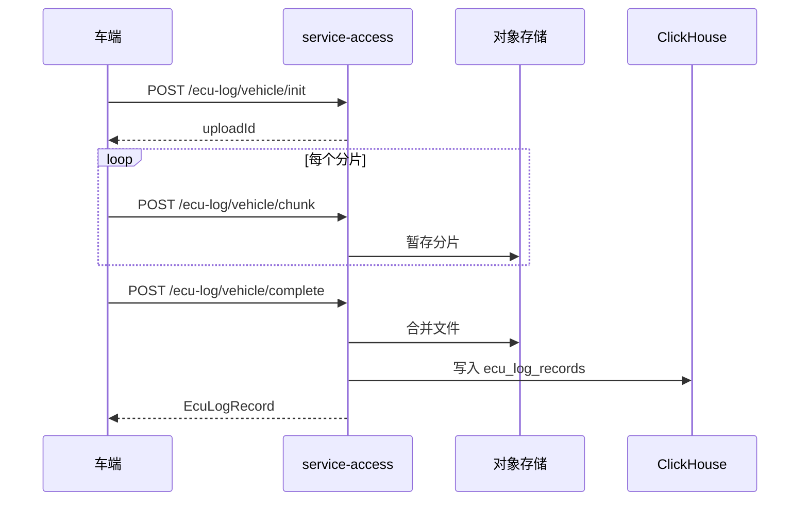
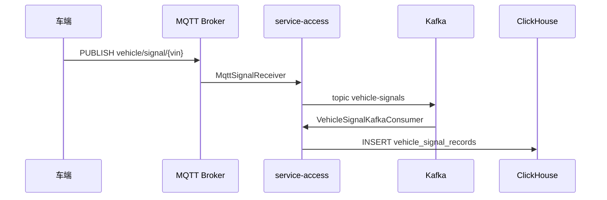
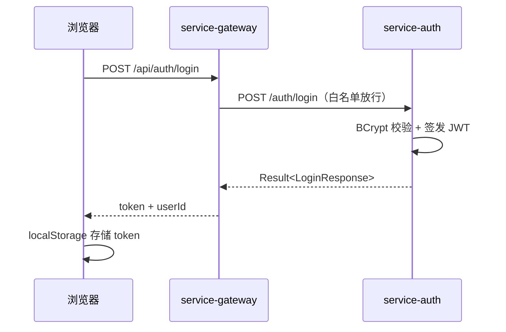

# 车辆远程诊断系统 — 系统详细设计说明书

## 1. 文档信息

| 项目 | 内容 |
|------|------|
| 系统名称 | 车辆远程诊断系统（VRD） |
| 版本 | v1.0.0-SNAPSHOT |
| 关联文档 | [系统概要设计说明](./系统概要设计说明.md)、[系统接口文档](./系统接口文档.md) |

---

## 2. 系统架构设计

本章给出系统总体架构、数据流与部署架构的可视化设计图，与当前代码实现保持一致（以 Nacos + ClickHouse + service-access 为准）。

### 2.1 系统总体架构图

> **图 2-1 系统总体架构图**


系统采用七层分层架构：

| 序号 | 层次 | 组件 | 说明 |
|------|------|------|------|
| ① | 展现层 | frontend | Vue3 管理端，端口 3000 |
| ② | 网关层 | service-gateway | 统一 API 入口，StripPrefix 路由，JWT 前置校验 |
| ③ | 服务层 | 6 个业务微服务 | auth/vehicle/ecu-log/dbc/signal/access |
| ④ | 数据层 | MySQL / Redis / ClickHouse / 对象存储 | 事务数据、缓存、时序分析、文件实体 |
| ⑤ | 中间件 | Kafka / MQTT | 异步消息与物联网接入 |
| ⑥ | 接入层 | service-access | 车端 HTTP 日志/信号、MQTT 信号统一接入 |
| ⑦ | 车端 | ECU + 车载网关 | 数据采集与上报 |

**Nacos** 独立侧挂：各微服务启动注册、运行时发现，网关通过 `lb://` 负载均衡转发。

**服务与数据归属**（见图 2-1 底部矩阵）：

- service-auth → MySQL（vrd_auth）、Redis
- service-vehicle → MySQL（vrd_vehicle）、Kafka（vehicle-data）
- service-ecu-log → ClickHouse（查询）、对象存储（下载）
- service-dbc → MySQL（vrd_dbc）、对象存储
- service-signal → ClickHouse（查询）
- service-access → ClickHouse（写入）、对象存储、Kafka、MQTT

### 2.2 数据流架构图

> **图 2-2 数据流架构图**


**管理端下行**：浏览器 → frontend → gateway → 微服务 → 持久化存储。

**车端上行（三条链路）**：

1. **信号链路**：车端 → MQTT/HTTP → service-access → Kafka `vehicle-signals` → ClickHouse → service-signal 查询
2. **日志链路**：车端 → HTTP 分片/直传 → service-access → 对象存储 + ClickHouse → service-ecu-log 查询/下载
3. **车辆同步**：外部系统 → Kafka `vehicle-data` → service-vehicle → MySQL

### 2.3 部署架构图

> **图 2-3 部署架构图**


Docker Compose 分层部署：

- **基础设施层**：MySQL、Redis、Zookeeper、Kafka、Mosquitto、Nacos、ClickHouse、Hadoop
- **微服务层**：gateway、auth、vehicle、ecu-log、dbc、signal、access（均注册至 Nacos）
- **展现层**：frontend（Nginx 静态托管或 Vite 开发服务）

---

## 3. 模块详细设计

### 3.1 service-gateway（API 网关）


**职责**：统一入口、服务路由、全局 CORS、认证前置过滤。

**路由规则**（`backend/service-gateway/src/main/resources/application.yml`）：

| 网关路径 | 目标服务 | StripPrefix |
|----------|----------|-------------|
| `/api/auth/**` | service-auth | 1 |
| `/api/vehicle/**` | service-vehicle | 1 |
| `/api/ecu-log/vehicle/**` | service-access | 1 |
| `/api/signal/vehicle/**` | service-access | 1 |
| `/api/ecu-log/**` | service-ecu-log | 1 |
| `/api/dbc/**` | service-dbc | 1 |
| `/api/signal/**` | service-signal | 1 |

**认证过滤器 `AuthFilter`**（`com.vrd.gateway.config.AuthFilter`）：

- 白名单：`/api/auth/login`、`/api/auth/register`、`/actuator/**`
- 其他请求：检查 `Authorization: Bearer ` 前缀，缺失则返回 HTTP 401
- 不调用 `/auth/validate`，不解析 JWT 签名与过期时间

**依赖**：Redis（限流/缓存预留）、Sentinel（熔断限流，Nacos 配置）。

---

### 3.2 service-auth（认证服务）

**包结构**：

```
com.vrd.auth
├── controller/   AuthController, UserManageController, RoleManageController
├── service/      UserService, RoleService
├── entity/       User, Role, UserRole
├── dto/          LoginRequest, LoginResponse, RegisterRequest, UserManageRequest, UserVO, RoleRequest
├── mapper/       UserMapper, RoleMapper, UserRoleMapper
└── util/         JwtUtil
```

**认证流程**：

1. `POST /auth/login`：查询 `sys_user` → BCrypt 校验密码 → 检查 status=1 → 签发 JWT
2. JWT Claims：`userId`、`username`；默认过期 86400000ms（24 小时）
3. `GET /auth/validate`：解析并校验 JWT 签名与过期

**预置角色**（`scripts/init.sql`）：

| role_code | role_name | 说明 |
|-----------|-----------|------|
| ADMIN | 系统管理员 | 全部权限（数据层定义，API 未强制） |
| OPERATOR | 操作员 | 业务操作 |
| VIEWER | 只读用户 | 只读查看 |

**数据模型**（数据库 `vrd_auth`）：

- `sys_user`：用户账号（username 唯一，password BCrypt 存储）
- `sys_role`：角色定义（role_code 唯一）
- `sys_user_role`：用户-角色多对多（uk_user_role 唯一约束）

---

### 3.3 service-vehicle（车辆服务）

**核心类**：

| 类 | 职责 |
|----|------|
| VehicleController | 车辆 CRUD、统计、同步、ECU 管理 |
| VehicleModelController | 车型 CRUD |
| SyncLogController | 同步记录分页/详情 |
| VehicleService | 业务逻辑、Kafka 消费、统计聚合 |

**数据模型**（数据库 `vrd_vehicle`）：

| 表 | 说明 |
|----|------|
| vehicle_model | 车型（品牌、厂商、动力参数等） |
| vehicle | 车辆（VIN 唯一、配置字、data_source: 1手动/2Kafka/3API） |
| vehicle_ecu | ECU 零部件 |
| vehicle_alert | 告警记录 |
| vehicle_fault | DTC 故障码 |
| vehicle_online_stat | 在线统计（granularity: hour/day） |
| vehicle_alert_trend_stat | 故障趋势（hour/day/week/month） |
| sync_log | Kafka/API 同步审计 |

**同步机制**：

- Kafka 主题 `vehicle-data`，消息格式：

```json
{
  "action": "CREATE|UPDATE|DELETE",
  "data": { "vin": "...", "modelId": 1, ... },
  "timestamp": 1704067200000
}
```

- `POST /vehicle/sync/kafka`：触发 Kafka 消费并写入/更新车辆
- `POST /vehicle/sync/api?apiUrl=...`：HTTP GET 外部 API，批量导入车辆数组
- 每次同步写入 `sync_log`（sync_type、status、payload、vin、action 等）

---

### 3.4 service-access（车端接入层）

**职责**：车端数据统一入口，MQTT 与日志上传的唯一实现点。

**信号接入链路**：

```
MQTT (vehicle/signal/+) ──→ MqttSignalReceiver ──→ KafkaMessageProducer ──→ topic: vehicle-signals
HTTP POST /signal/vehicle/receive ──→ KafkaMessageProducer
VehicleSignalKafkaConsumer ──→ SignalIngestServiceImpl ──→ ClickHouse vehicle_signal_records
```

**MQTT 配置**（`application.yml`）：

```yaml
mqtt:
  url: tcp://localhost:1883
  topic: vehicle/signal/+
  qos: 1
```

**日志上传**（`VehicleLogController`，路径前缀 `/ecu-log/vehicle`）：

| 接口 | 说明 |
|------|------|
| POST /init | 初始化分片上传，返回 uploadId |
| POST /chunk | 上传分片（multipart: uploadId, chunkNumber, file） |
| POST /complete | 合并分片，写入对象存储 + ClickHouse |
| POST /report | 整包直传 |

**实现类**：`VehicleLogUploadServiceImpl`、`EcuLogIngestServiceImpl`

**存储策略**：通过 `common` 模块 `StorageService` 抽象，支持：

- LOCAL（本地文件系统）
- 阿里云 OSS
- 华为 OBS
- MinIO

---

### 3.5 service-ecu-log（日志查询服务）

**职责**：管理端日志检索与下载，不承担车端上传。

**核心类**：

- `EcuLogController`：分页查询、文件下载
- `EcuLogClickHouseServiceImpl`：ClickHouse 查询实现
- `EcuLogService`：业务编排

**数据流**：

1. 读 ClickHouse `vrd_bigdata.ecu_log_records` 分页
2. 按 `storage_key` 从 `StorageService` 拉取实体文件
3. `GET /ecu-log/download/{id}` 返回 `application/octet-stream`

---

### 3.6 service-dbc（DBC 管理服务）

**核心流程**：

1. `POST /dbc/upload`：接收 multipart 文件 → 解析 CAN 消息/信号 → 写入 MySQL `dbc_file`（含 parse_result、message_count、signal_count）
2. `GET /dbc/{id}/messages`：从 parse_result 提取消息名列表
3. `GET /dbc/{id}/signals`：提取信号定义（name、startBit、length、factor 等）
4. `POST /dbc/{id}/dispatch/{vehicleId}` 或 `/dispatch`：下发到车端，记录 `dispatch_log`

**数据模型**（数据库 `vrd_dbc`）：

- `dbc_file`：文件元数据与解析结果
- `dispatch_log`：下发记录（dbc_file_id、vehicle_id、vin、status、result）

---

### 3.7 service-signal（信号查询服务）

**职责**：历史信号时序查询，只读 ClickHouse。

**核心类**：

- `SignalController`：timeline、page、signal-name、单条查询
- `SignalService`：时间范围查询、分页封装

**注意**：MySQL `vrd_signal.vehicle_signal` 为遗留表，运行时查询已切换至 ClickHouse `vehicle_signal_records`。

**timeline 聚合逻辑**：按 `signalName` 分组，返回 `total`、`timeline`（Map）、`signals`（平铺列表）。

---

### 3.8 common / common-db（公共模块）

**common 模块**：

| 组件 | 说明 |
|------|------|
| `Result<T>` | 统一 JSON 响应包装 |
| `BusinessException` | 业务异常 |
| `StorageService` | 多后端对象存储抽象 |
| Nacos 自动配置 | 服务发现与配置热更新 |

**common-db 模块**：

- MyBatis-Plus 分页插件配置
- 逻辑删除全局字段 `deleted`

---

### 3.9 frontend（前端）

**技术栈**：Vue 3.4 + Vite 5 + Element Plus 2.4 + Pinia + Axios + ECharts 5

**目录结构**：

```
frontend/src/
├── api/          # 后端 API 封装（auth.js, vehicle.js, ecuLog.js, dbc.js, signal.js, system.js）
├── views/        # 页面组件
├── router/       # 路由与守卫
└── utils/        # request.js（Axios 拦截器，自动附加 JWT）
```

**路由与页面对应**：

| 路由 | 组件 | 功能 |
|------|------|------|
| /login | Login.vue | 登录 |
| /dashboard | Dashboard.vue | 仪表盘 |
| /vehicle/model | VehicleModel.vue | 车型管理 |
| /vehicle/list | VehicleList.vue | 车辆列表 |
| /vehicle/detail/:id | VehicleDetail.vue | 车辆详情 |
| /vehicle/sync-record | VehicleSyncLog.vue | 同步记录 |
| /ecu-log | EcuLog.vue | 日志分析 |
| /dbc | Dbc.vue | DBC 配置 |
| /signal/fault | FaultMonitor.vue | 故障监控 |
| /signal/playback | SignalPlayback.vue | 信号回放 |
| /settings/user | UserManage.vue | 账号管理 |
| /settings/role | RoleManage.vue | 权限管理 |

**路由守卫**：仅检查 localStorage 中 token 是否存在，不校验角色权限。

**开发代理**：Vite 将 `/api` 代理至 `http://localhost:8080`。

---

## 4. 数据库详细设计

### 4.1 MySQL 分库策略

| 数据库 | 服务 | 核心表 |
|--------|------|--------|
| vrd_auth | service-auth | sys_user, sys_role, sys_user_role |
| vrd_vehicle | service-vehicle | vehicle_model, vehicle, vehicle_ecu, vehicle_alert, vehicle_fault, sync_log 等 |
| vrd_ecu_log | （遗留） | ecu_log_file, upload_chunk |
| vrd_dbc | service-dbc | dbc_file, dispatch_log |
| vrd_signal | （遗留） | vehicle_signal, signal_batch |

**通用约定**：

- 主键：`BIGINT AUTO_INCREMENT`
- 逻辑删除：`deleted INT DEFAULT 0`（0=正常，1=已删）
- 时间戳：`create_time`、`update_time`（DATETIME）
- 字符集：utf8mb4

### 4.2 ClickHouse 表设计（`vrd_bigdata`）

**ecu_log_records**：

```sql
ENGINE = MergeTree()
PARTITION BY toYYYYMM(upload_start_time)
ORDER BY (ecu_type, vin, upload_start_time)
```

主要字段：id, vin, ecu_type, log_start_time, log_end_time, upload_start_time, upload_end_time, storage_address, storage_key, storage_type, file_name, file_size, file_md5, create_time

**vehicle_signal_records**：

```sql
ENGINE = MergeTree()
PARTITION BY toYYYYMM(signal_time)
ORDER BY (vin, signal_name, signal_time)
```

主要字段：id, vin, vehicle_id, signal_name, signal_value, numeric_value, unit, timestamp, signal_time, message_name, message_id, create_time

---

## 5. 统一响应格式

所有 JSON API 使用 `com.vrd.common.result.Result<T>` 包装：

```json
{
  "code": 200,
  "message": "success",
  "data": { }
}
```

| code | 说明 |
|------|------|
| 200 | 成功 |
| 401 | 认证失败 |
| 403 | 账号禁用 |
| 500 | 业务异常 |

文件下载接口（DBC、ECU 日志）直接返回二进制流，不使用 Result 包装。

---

## 6. 安全设计

| 层次 | 现状 | 建议增强 |
|------|------|----------|
| 传输层 | 开发环境 HTTP | 生产强制 HTTPS/TLS |
| 认证 | JWT + BCrypt 密码哈希 | 网关调用 `/auth/validate` 验签 |
| 授权 | RBAC 数据模型存在 | 接口级 `@PreAuthorize` 或网关权限路由 |
| 车端接入 | 需 Bearer Token（非白名单） | 独立 API Key / 设备证书白名单 |
| 敏感配置 | jwt.secret 在 application.yml | 迁移至 Nacos 加密配置 |

---

## 7. 关键时序设计

### 7.1 ECU 日志分片上传



### 7.2 信号实时接入



### 7.3 管理端登录



---

## 8. 配置与部署

### 8.1 服务端口一览

| 服务 | 端口 |
|------|------|
| service-gateway | 8080 |
| service-auth | 8081 |
| service-vehicle | 8082 |
| service-ecu-log | 8083 |
| service-dbc | 8084 |
| service-signal | 8085 |
| service-access | 8086 |
| frontend | 3000 |
| Nacos | 8848 |
| Kafka | 9092 |
| MQTT | 1883 |
| MySQL | 3306 |
| Redis | 6379 |
| ClickHouse HTTP | 8123 |

### 8.2 Nacos 配置

配置模板目录：`backend/nacos-configs/`

各服务通过 `bootstrap.yml` 连接 Nacos，支持配置热更新。导入脚本：`backend/nacos-configs/import-configs.sh`。

### 8.3 Docker 数据卷

| 挂载路径 | 用途 |
|----------|------|
| /data/vrd/uploads | 车辆服务上传 |
| /data/vrd/logs | ECU 日志、接入层日志 |
| /data/vrd/dbc | DBC 文件 |
| /data/vrd/storage | 接入层对象存储（LOCAL 模式） |

---

## 9. 待建设模块

| 模块 | 状态 | 说明 |
|------|------|------|
| service-bigdata | 未实现 | 前端 bigdata.js 有引用，无后端与网关路由 |
| Doris OLAP | 仅文档/脚本 | `docker-compose-doris.yml`、`backend/doris/` |
| diagnostics Kafka 消费 | 未实现 | 主题已规划，无消费者 |
| Eureka service-register | 遗留 | 代码存在，未编入 backend/pom.xml modules |
